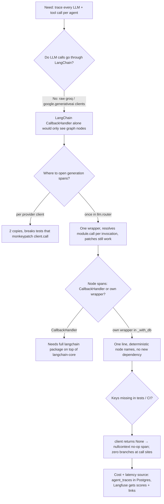
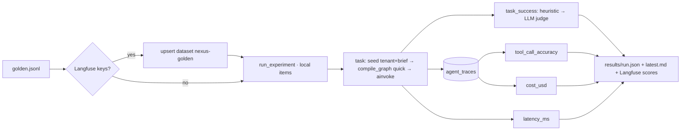

# Nexus — Autonomous Research Intelligence

**Multi-agent AI research platform — 7 specialized agents that search, analyze, debate, and write intelligence reports with full reasoning transparency.**

[](.github/workflows/ci.yml)
[](requirements.txt)
[](requirements.txt)
[](requirements.txt)
[](dashboard/requirements.txt)
[](#)

---

Junior analysts at McKinsey and Goldman Sachs spend weeks on research briefs Nexus completes in minutes. Unlike single-agent RAG systems, Nexus deploys a team: a supervisor plans, specialists research in parallel, a fact-checker actively disputes low-confidence claims, specialists defend or retract in structured debate, and a writer produces audience-aware reports — all visible in real time via a live agent trace.

Built on LangGraph's state machine with parallel node execution, human-in-the-loop interrupts, and persistent knowledge accumulation. Multi-provider: Groq (Llama 3.3 70B) for reasoning-heavy agents, Gemini 1.5 Flash for large-context synthesis. Every decision, tool call, and debate is logged and downloadable.

## Features

- ✅ LangGraph state machine — parallel + conditional edges, dynamic re-planning, human-in-the-loop interrupt/resume
- ✅ 7 specialized agents with distinct LLM assignments (supervisor, web_search, domain_knowledge, data_analyst, fact_checker, synthesis, writer)
- ✅ Groq (Llama 3.3 70B / 3.1 8B) + Gemini 1.5 Flash — free-tier-friendly multi-provider routing
- ✅ Fact-checker agent with a structured adversarial debate protocol
- ✅ Confidence propagation per claim → section → report, with trusted-source and corroboration boosts
- ✅ Live agent trace — WebSocket streaming, color-coded by agent/event type
- ✅ Human-in-the-loop review + revision checkpoints (approve / revise / expand)
- ✅ Persistent knowledge base (ChromaDB) with prior-research priming and brief comparison
- ✅ PDF report + agent trace PDF + email delivery, low-confidence alert subject line
- ✅ Free/Pro tier model with per-endpoint rate limiting
- ✅ Prometheus + Grafana observability (21 custom metrics, 4 provisioned dashboards)
- ✅ Langfuse tracing of every LLM and tool call (run → agent → generation/tool), per-agent tool-call traces persisted to PostgreSQL
- ✅ Agent eval suite — task success, tool-call accuracy, cost and latency per run over a 20-question golden set, recorded as Langfuse dataset runs
- ✅ Full Streamlit product UI — onboarding, brief wizard, live trace, review, library, knowledge base

## Agent Architecture

```
                              ┌──────────────────┐
                              │   supervisor      │  Groq 70B — plans, checks KB, re-plans on gaps
                              │  (checks KB first)│
                              └─────────┬─────────┘
                    ┌────────────────────┼────────────────────┐
                    ▼                    ▼                    ▼
            ┌──────────────┐    ┌──────────────────┐  ┌──────────────┐
            │  web_search  │    │ domain_knowledge  │  │ data_analyst │
            │  Groq 8B     │    │  Groq 70B         │  │ Gemini Flash │
            └──────┬───────┘    └─────────┬─────────┘  └──────┬───────┘
                   │                      │                    │
                   └──────────────────────┼────────────────────┘
                                           ▼
                                  ┌─────────────────┐
                                  │   fact_checker    │  Groq 70B — adversarial review
                                  │  (may trigger      │
                                  │   debate protocol) │
                                  └────────┬───────────┘
                          conf<0.4 & orig>0.7  │  else
                                  ┌────────────┴────────────┐
                                  ▼                          ▼
                          ┌───────────────┐          ┌───────────────┐
                          │    debate      │          │  replan /      │
                          │ defense→verdict│          │  synthesize    │
                          └───────┬────────┘          └───────┬────────┘
                                  └──────────────┬─────────────┘
                                                  ▼
                                         ┌─────────────────┐
                                         │   synthesis       │  Gemini Flash — structures sections
                                         └────────┬───────────┘
                                                  ▼
                                         ┌─────────────────┐
                                         │     writer         │  Groq 70B — audience-aware prose
                                         └────────┬───────────┘
                                                  ▼
                                     ⏸  human_review (interrupt)
                                        approve → complete → PDF + email
                                        revise  → back to synthesize
```

## LangGraph StateGraph

```
START ──▶ supervisor_plan ──▶ [web_search, domain_knowledge, data_analyst]  (parallel fan-out)
                                        │
                                        ▼  (join — waits for all three)
                                    fact_check ──▶ conditional:
                                        │             "synthesize"     → continue
                                        │             "research_more"  → replan ──▶ web_search (loop, max 2×)
                                        ▼
                                    synthesize ──▶ write ──▶ human_review (interrupt, checkpointed)
                                                                  │
                                                    conditional:  │
                                              "complete" ◀────────┼────────▶ "synthesize" (revise)
                                                  │
                                                  ▼
                                                 END
```

`depth=quick` skips `data_analyst` and `human_review` entirely — fastest path to `complete`.

## Confidence Propagation

```
claim_confidence   = base_llm_confidence
                    + 0.10  if source is in the domain's trusted-domain allowlist
                    + 0.05 × corroborating_agent_count
                    − 0.30  if disputed by fact-checker
                    − 0.50  if retracted after a debate round
                    (clamped to [0, 1])

section_confidence = importance-weighted average of its claims' confidences
report_confidence  = word-count-weighted average of its sections' confidences

label:  ≥0.8 HIGH  ·  ≥0.6 MEDIUM  ·  ≥0.4 LOW  ·  <0.4 UNVERIFIED
```

## Debate Protocol — example

```
Claim: "GPT-5 released Q1 2025"                          confidence: 0.90
Fact-checker: no credible source found                   → disputed, confidence: 0.20

should_debate(0.20, 0.90) → True   (fact-checker <0.4 AND original agent >0.7: genuine disagreement)

Round 1 — Defense (web_search, Groq):
  "Searching for corroborating evidence..."
  → 0 supporting sources found → retract=true

Round 2 — Verdict (fact_checker, Groq):
  retracted → final_confidence = 0.1

Result: claim marked disputed, final_confidence=0.1, full round logged as
        web_search_debate_defense + fact_checker_debate_verdict agent_traces
        (visible in the dashboard's expandable debate viewer)
```

## Quick Start

```bash
git clone <this-repo> && cd nexus
cp .env.example .env   # fill in GROQ_API_KEY / GEMINI_API_KEY / TAVILY_API_KEY for live runs
docker-compose up --build
```

| Service | URL |
|---|---|
| API | http://localhost:8000 |
| Dashboard | http://localhost:8501 |
| Grafana | http://localhost:3000 (admin/admin) |
| Prometheus | http://localhost:9090 |

For local (non-Docker) development, manual commands per component are in **[RUNBOOK.md](RUNBOOK.md)**.

Live demo script (needs real API keys):
```bash
python demo/run_demo.py --depth standard
```

## API Reference — key endpoints

| Method | Path | Purpose |
|---|---|---|
| `POST` | `/v1/auth/register` | Create a tenant, get an API key (shown once) |
| `POST` | `/v1/auth/token` | Exchange API key for a JWT |
| `POST` | `/v1/briefs/preview` | Complexity estimate before submitting |
| `POST` | `/v1/briefs` | Submit a research brief (enqueues the LangGraph run) |
| `GET` | `/v1/briefs/{id}` | Brief status + supervisor plan |
| `GET` | `/v1/briefs/{id}/traces` | Full agent trace log |
| `GET` | `/v1/briefs/{id}/claims` | Claims, with verified/disputed filters |
| `WS` | `/v1/briefs/{id}/stream` | Live agent event stream |
| `POST` | `/v1/briefs/{id}/resume` | Approve / revise / expand after human review |
| `GET` | `/v1/briefs/{id}/report/download/{pdf,trace,json}` | Report + trace PDFs, structured JSON |
| `POST` | `/v1/briefs/{id}/report/email` | Resend the report email |
| `POST` | `/v1/briefs/compare` | Diff two completed briefs |
| `GET` | `/v1/knowledge`, `/v1/knowledge/related` | Knowledge base summary + semantic search |
| `GET` | `/health/live`, `/health/ready` | Liveness / readiness (DB + Redis + Chroma) |
| `GET` | `/metrics` | Prometheus exposition (no auth) |

## Tech Stack

`Python 3.11` · `FastAPI` · `SQLAlchemy (async) + PostgreSQL 15` · `Redis 7` · `Celery` · `ChromaDB` · `LangGraph` · `LangChain Core` · `Groq` · `Google Generative AI` · `Tavily` · `Streamlit` · `ReportLab` · `Prometheus` · `Grafana` · `Langfuse` · `Kubernetes`

## Grafana Dashboards

Provisioned automatically from `grafana/dashboards/`:

1. **Platform Overview** — briefs/day, completion rate, avg duration by depth, confidence distribution, verified vs disputed claims
2. **Agent Performance** — calls/hr per agent, latency, token consumption per provider, debate win/loss ratio
3. **Research Intelligence** — confidence by domain/depth, knowledge base growth, approval vs revision rate, top topics
4. **System & Product** — active WebSocket connections, report generation/email rate, tier-limit pressure, weekly volume trend

## Observability — Langfuse tracing

Every brief run produces one Langfuse trace whose tree mirrors the graph. Prometheus answers *how much / how fast*
in aggregate; Langfuse answers *what exactly did agent X send to the model and what came back* for one run.

```
research_brief  (agent span · session_id = brief_id · tags = [depth, domain] · metadata.run_id)
├── groq/llama-3.3-70b-versatile        generation   ← assess_brief_complexity
├── supervisor_plan                     agent
│   └── groq/llama-3.3-70b-versatile    generation   (input messages, output, prompt/completion tokens)
├── web_search                          agent
│   ├── web_search                      tool         (query, max_results, domain → results)
│   └── groq/llama-3.1-8b-instant       generation
├── domain_knowledge                    agent
│   ├── search_knowledge_base           tool
│   └── groq/llama-3.3-70b-versatile    generation
├── data_analyst                        agent
│   ├── web_search · calculate          tool
│   └── gemini/gemini-1.5-flash         generation
├── fact_check                          agent   (one web_search tool + one generation per claim)
├── synthesize · write                  agent
└── (human_review wait is inside the root span — real end-to-end latency, review time included)
```

Where the hooks live (all no-ops when `LANGFUSE_PUBLIC_KEY` / `LANGFUSE_SECRET_KEY` are unset, so tests and CI never need a Langfuse server):

| Layer | Hook | File |
|---|---|---|
| Run | root `agent` span + `propagate_attributes(session_id, tags, metadata)`; `flush()` in the Celery task's `finally` | `app/workers/tasks.py` |
| Graph node | `agent` span named after the node, wrapping the DB session | `app/agents/graph.py` (`_with_db`) |
| LLM call | `generation` span with model, input messages, output, `usage_details` | `app/llm/router.py` (`_traced`) |
| Tool call | `tool` span with arguments and result | `app/tools/*.py` (`@traced_tool`) |
| Client gate | `client()` / `observation()` / `trace_attributes()` / `flush()` | `app/core/tracing.py` |

The same tool calls are also persisted per agent in PostgreSQL (`agent_traces.tool_calls`, `prompt_tokens`, `completion_tokens`, `latency_ms`) — that table, not Langfuse, is the source of truth the eval suite reads.

Setup: create a project on [Langfuse Cloud](https://cloud.langfuse.com) (free tier) or [self-host](https://langfuse.com/self-hosting), then set `LANGFUSE_PUBLIC_KEY`, `LANGFUSE_SECRET_KEY`, `LANGFUSE_HOST` in `.env`. Traces appear under **Sessions** keyed by `brief_id`.

_Screenshot placeholder — after the first live run, add `docs/langfuse-trace.png` (Traces → any `research_brief` → expand tree) here._

### Decision flow — how the tracing design was chosen



| Decision | Chosen | Rejected | Why |
|---|---|---|---|
| Generation span location | `app/llm/router.py` wrapper | inside each provider client | one place for both providers; tests that patch `groq_client.call` keep working |
| Node spans | own `agent` span in `_with_db` | `langfuse.langchain.CallbackHandler` | handler imports the full `langchain` package (not installed, ~+30 deps) for what one line does |
| Disabled mode | `nullcontext(_NoopSpan)` | `if tracing.enabled():` at every call site | call sites stay identical; CI has no Langfuse |
| Cost/latency source | `agent_traces` table | Langfuse API | already persisted, no network dependency in evals, works with tracing disabled |
| Langfuse self-host | not in `docker-compose.yml` | add langfuse + clickhouse + minio services | v3 self-host is 5 containers; cloud free tier is enough for a portfolio project |

## Evals — agent eval suite

`evals/golden.jsonl` holds 20 research questions, each with 3–5 expected key facts and the tools that must be called.
`evals/run_evals.py` runs the **real** quick-depth pipeline (live Groq/Gemini/Tavily) per question and scores:

| Metric | Definition | Source |
|---|---|---|
| `task_success` | fraction of expected facts present in the final brief — token-coverage heuristic (≥80 % of content tokens) first; an LLM judge (Llama 3.3 70B, `YES/NO`) tie-breaks only the misses | final report text |
| `tool_call_accuracy` | expected tools called with a non-empty query (a blank query counts as not called) | `agent_traces.tool_calls` |
| `cost_usd` | Σ prompt/completion tokens × provider list price per model | `agent_traces.prompt_tokens/completion_tokens` |
| `latency_ms` | wall-clock of the graph run; p50/p95 over the set | runner |

With Langfuse configured the golden set is upserted as dataset `nexus-golden` and each run becomes a **dataset run**
with the four scores attached, so two prompt or model versions can be compared side by side in the Langfuse UI.



```bash
.venv/bin/python -m evals.run_evals --limit 5 --run-name baseline     # CLI, prints the table below
.venv/bin/python -m pytest -m evals evals/                             # pytest entry; skipped without keys
EVAL_LIMIT=3 EVAL_MIN_SUCCESS=0.6 .venv/bin/python -m pytest -m evals evals/
```

Results from one run (`evals/results/latest.md` — regenerate after any prompt/model change and paste here):

_Pending: run `python -m evals.run_evals` with live keys and paste the table from `evals/results/latest.md`._

| id | topic | task_success | tool_call_accuracy | cost_usd | latency_ms |
|---|---|---|---|---|---|
| … | … | … | … | … | … |

**Aggregate:** task_success … · tool_call_accuracy … · cost $… total · latency p50 … ms / p95 … ms

## Test commands

```bash
# one-time
/opt/homebrew/bin/python3.11 -m venv .venv && .venv/bin/pip install -r requirements.txt
# services (local, non-Docker — see RUNBOOK.md Terminal 1) then:
export DATABASE_URL="postgresql+asyncpg://nexus@/nexus?host=/tmp/nexus_pg_sock&port=5544"
export REDIS_URL="redis://localhost:6399/0"
export CHROMA_PERSIST_DIR="$(pwd)/.local/chroma_data"
.venv/bin/alembic upgrade head

.venv/bin/ruff check app tests evals                                  # lint
.venv/bin/python -m pytest -q tests/                                  # 29 tests, LLM/search mocked, real Postgres/Redis
.venv/bin/python -m pytest -q tests/test_evals_scoring.py             # pure scoring logic, no DB
.venv/bin/python -m pytest -q tests/test_evals_runner.py              # eval runner end-to-end, mocked LLM
.venv/bin/python -m pytest --cov=app --cov-fail-under=70 tests/       # CI gate

# tracing smoke (spans built, export fails loudly against a dummy host — proves the enabled path):
LANGFUSE_PUBLIC_KEY=pk LANGFUSE_SECRET_KEY=sk LANGFUSE_HOST=http://127.0.0.1:1 \
  .venv/bin/python -m pytest -q tests/test_graph_e2e.py

# live evals (needs GROQ/GEMINI/TAVILY keys; Langfuse optional):
.venv/bin/python -m evals.run_evals --limit 3
```

## Known Deviations From Spec (documented, not hidden)

- **ChromaDB**: uses the embedded `PersistentClient` (file-backed, shared volume) rather than a standalone `chromadb` server container — matches what Sprints 2-4 actually built and tested. Fine for single-API-replica dev; a real multi-replica k8s deployment (see `k8s/api/deployment.yaml` comment) needs a networked Chroma server instead, since the embedded client isn't safe for concurrent multi-pod writes.
- **Email**: stdlib `smtplib`/`email.mime` instead of `fastapi-mail` — `fastapi-mail==1.6.5` hard-requires `starlette>=1.0`, which conflicts with `fastapi==0.115`'s `starlette<0.39`. No functional difference; one fewer dependency.
- **Word cloud**: the knowledge base page renders topics as tags, not a frequency-weighted word cloud — the API only exposes distinct topics, not per-topic counts. Add a `/knowledge/topic-counts` endpoint to enable true weighting.
- **Recurring briefs**: the dashboard toggle is present but disabled — no cron/beat scheduler exists in this build.
- **k8s dry-run**: manifests are YAML-syntax-validated; a full `kubectl apply --dry-run=client` needs a reachable cluster (none available in the build sandbox — no kind/minikube installed).
- **Package manager**: `requirements.txt`, not Poetry/`pyproject.toml`, per explicit instruction mid-build.


## Author

**Yash Pabari** — AI/ML Engineer
